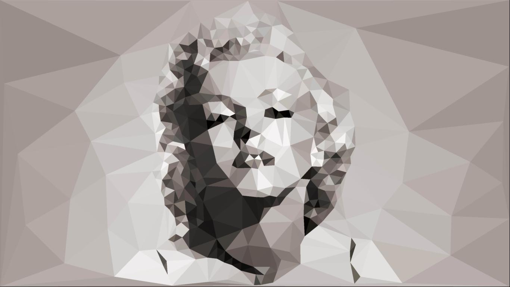
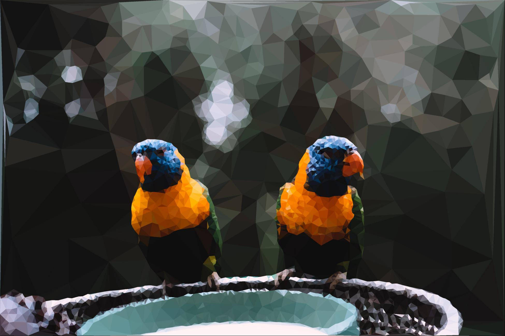
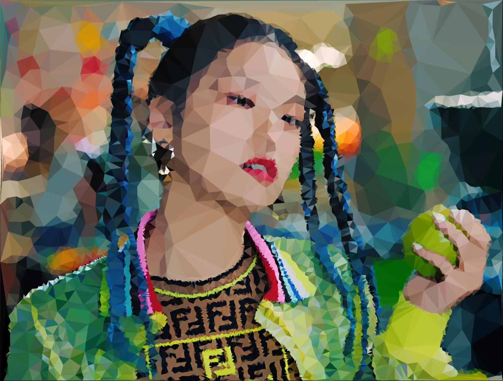

[](https://www.python.org/downloads/)
[](https://github.com/psf/black)
[](https://opensource.org/licenses/MIT)
[](https://github.com/tdh8316/triangler/stargazers)
[](https://twitter.com/intent/tweet?text=Convert%20images%20to%20Low-Poly%20art:&url=https%3A%2F%2Fgithub.com%2Ftdh8316%2Ftriangler)

# Overview
`Triangler` is a tool to generate Low-Polygon image using [Delaunay triangulation](https://en.wikipedia.org/wiki/Delaunay_triangulation).



# Table of contents
1. [Installation](#installation)
    1. [Download](#download-windows-binary)
    2. [Running from source](#running-from-source)
2. [Usage](#usage)
3. [Use as a library](#api)
    1. [API](#api)
4. [Sample](#sample)
5. [License](#license)

# Installation

## Download Windows Binary
You can download the binary for `Windows`.
Note that the Windows binary is slower than running from source.
 - [Download Page](https://github.com/tdh8316/triangler/releases)
 
>Note: The Binary Release is often old and needs to rebuild.

See [#usage](https://github.com/tdh8316/triangler#usage) section for usage.

## Running from source
You need [`Python 3.6`](https://www.python.org/) or higher.

I strongly recommend to use virtual environment such as `Anaconda`.
You can [download `Anaconda` here](https://www.anaconda.com/distribution/#download-section).

Follow manual below to create python virtual environment for `Triangler` with `Anaconda`.
```cmd
$ conda create -n triangler python=3.8
$ activate triangler
(triangler)$ git clone https://github.com/tdh8316/triangler.git
(triangler)$ cd triangler
(triangler)$ python setup.py install
```

# Usage
```
(triangler)$ triangler -h
usage: __main__.py [-h] [-o OUTPUT [OUTPUT ...]] [-s {POISSON_DISK,THRESHOLD}]
                   [-e {CANNY,ENTROPY,SOBEL}] [-b BLUR] [-c {MEAN,CENTROID}]
                   [-p POINTS] [-l REDUCE] [-v]
                   images [images ...]

positional arguments:
  images                Source files

optional arguments:
  -h, --help            show this help message and exit
  -o OUTPUT [OUTPUT ...], --output OUTPUT [OUTPUT ...]
                        Destination file (default: None)
  -s {POISSON_DISK,THRESHOLD}, --sample {POISSON_DISK,THRESHOLD}
                        Sampling method for candidate points. (default: THRESHOLD)
  -e {CANNY,ENTROPY,SOBEL}, --edge {CANNY,ENTROPY,SOBEL}
                        Pre-processing method to use. (default: SOBEL)
  -b BLUR, --blur BLUR  Blur radius for approximate canny edge detector.
                        (default: 2)
  -c {MEAN,CENTROID}, --color {MEAN,CENTROID}
                        Coloring method for rendering. (default: CENTROID)
  -p POINTS, --points POINTS
                        Points threshold. (default: 1024)
  -l, --reduce          Apply pyramid reduce to result image (default: False)
  -v, --verbose         Set logger level as DEBUG (default: False)
```

The sampling option; `POISSON_DISK` is extremely slow, while it can provide the best result.
>You can see the results by options [here](./PREVIEW.md).

It takes a minimum of 5 seconds (1000 points and threshold sampling) to a maximum of 3 minutes (50000 points and poisson disk sampling).

## API
See example:
```python
from skimage.io import imread
import triangler
import matplotlib.pyplot as plt

t = triangler.Triangler(sample_method=triangler.SampleMethod.POISSON_DISK)

img = imread("image.jpg")
img_tri = t.convert(img)

_, axes = plt.subplots(1, 2, figsize=(16, 16))
axes[0].imshow(img)
axes[1].imshow(img_tri)
plt.show()
```


# Sample
|Original|5000 Points|
|:------:|:---------:|
||
|**2500 Points**|**1000 Points**|
|||

|Original|Processed|
|--------|---------|
|||
|||
|||

# License
Licensed under the **MIT** License.

Copyright 2020 `Donghyeok Tak`

## Special thanks
Some algorithms, including the `Poisson disk sampling`, are based on [pmaldonado/PyTri](https://github.com/pmaldonado/PyTri).
